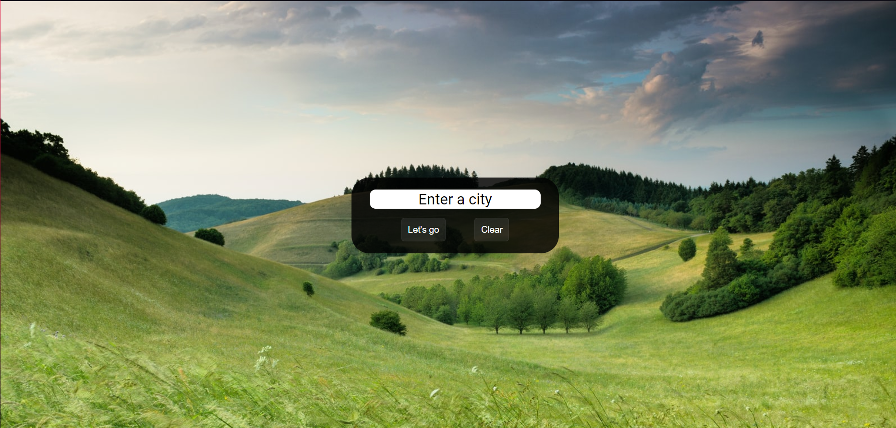
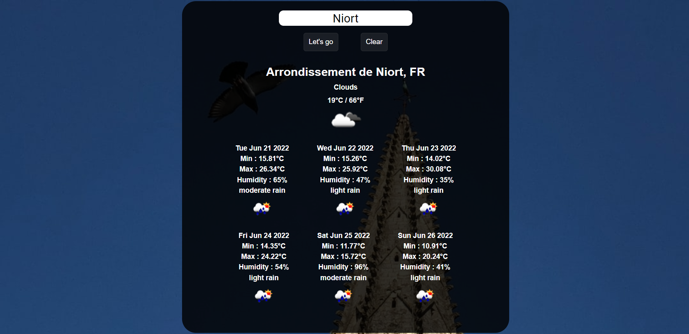

# WELCOME TO OUR BRAND NEW WEATHER APP !

## **With an improved design**

### Please take a quick look :

### And here : 

#### What is it ?

It's so simple ! : A simple weather app that gives you the weather of your city in a simple and clean way.
You can search for a city and get the weather of it. And... That's all !

#### How to use it ?

You can directly click on the search bar and type the name of the city you want to get the weather of.
Then press the search button or just press enter.
You can search up to 2 cities at the same time.
You need to clean the search bar before typing a new 2 city.

#### Technical details

- The app is made with HTML, CSS and JavaScript.
- I used the OpenWeatherMap API to get the weather of a city.
- The app is responsive and works on mobile and desktop.
- I used unsplash API to get the background image of the app.

#### Links

[App's URL](https://kiks4000.github.io/weather-app/)

[Github](https://github.com/Kiks4000)
[LinkedIn](https://www.linkedin.com/in/kevinkiks/)
[Twitter](https://twitter.com/KiksOnTwitch)

[OpenWeatherMap](https://openweathermap.org/)
[Unsplash](https://unsplash.com/)

##### Thanks for reading !
##### Weather App is a project made for BeCode.
